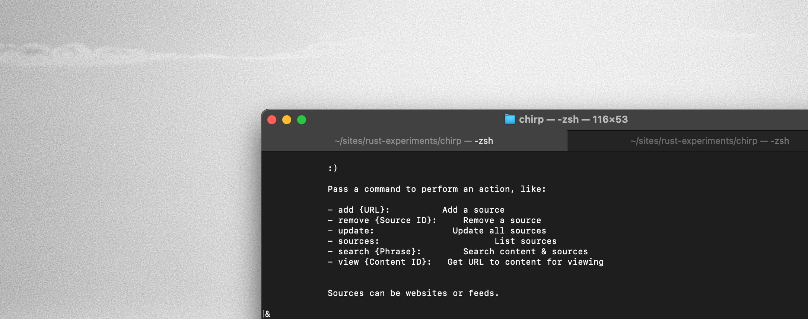

# Chirp

Track content.&nbsp;&nbsp;&nbsp;&nbsp;Filter, search, & uncover deeper context.

## Supported content

- Websites
- Feeds

## Prerequisites

Install Rust to build the binary executable.

You may use any Operating System (also known as an OS).

## Usage

From a shell run the app. Available commands will be presented.

## Developers

For more technical info run as dev.

`DEV=true cargo run {commands}`
