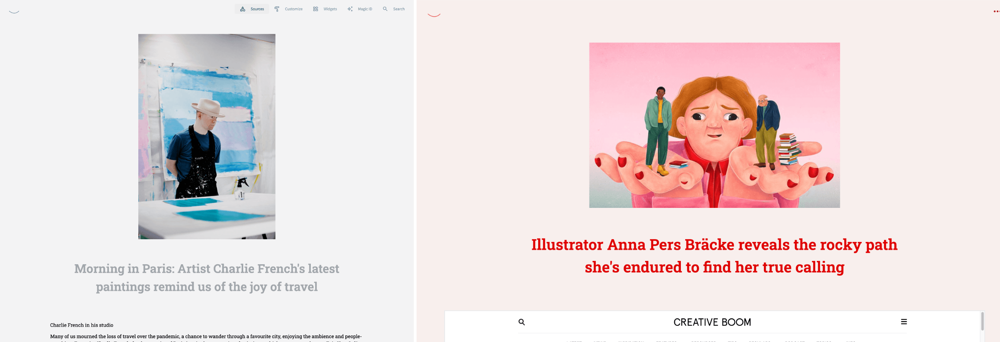

<!--  -->

# Stories

Make sense of the outer world that affects **your narrative**.

## Benefits

### Features

-   Follow RSS feeds
-   Follow Websites
-   Thumbnail and List views
-   Directories

## Build the app

1. Install [Node JS](https://nodejs.org/en/download)
2. Install [Yarn](https://classic.yarnpkg.com/lang/en/docs/install/#mac-stable), a nicer Node package manager
3. Install [Rust](https://www.rust-lang.org/tools/install), for compiling Rust binaries
4. Navigate to the project directory, then into the `./stories` subdirectory
5. Run `yarn tauri build`

## Starting Again

I previously built this app using C# and [Catalyst](https://github.com/curiosity-ai/catalyst). Upon discovering that I was being spied upon, I decided not to release the SAAS and instead release a free version that runs on users' own devices, due to my concerns that I would be exposing vulnerable users. I'm very friendly, but it's nice for people to be able to learn without advertising their interests to everyone. An additional concern of mine was regarding the risk of being charged with user's crimes, as it's like hosting a web browser for everyone to use. I believe the criminals can be found without any data access, due to their nature. The way the world is going is very frustrating for me and I'm torn between throwing everything away and different unknown solutions.

## App Symbolism &amp; World Events

After recent events of 2023-2024, it seems it is worth noting that I had made a joke about similar events before they happened. It turns out I'm not the first person to think that concerts are ideal venues to shoot people. My sincere apologies.

### Reader

The previous version of the application had a nice reader mode. It would use readability to display the article text, or when the article text was not provided it would display the web-page. This may be restored for RSS.

### Named Entity Recognition

Recognise entities in the text. Previously NER was performed extremely quickly with a high success rate using Catalyst. Entities are a fundamental component of making the app save time and yield better information.

## Develop the app

Use `yarn tauri dev`, not `yarn dev`.

### Platform-specific Steps

#### Ubuntu

- Install additional libraries as required for your OS
    - Refer to the current build file in `./.github/workflows/test-on-pr.yml`

#### Fedora

- The steps are the Fedora equivalent of Ubuntu

## Q &amp; A

- **Q)** Can this replace Feedly or Reeder?
    - **A)** No, nothing can replace Feedly.
- **Q)** Can you provide 1-click app downloads?
    - **A)** Not yet. App signing is required.
