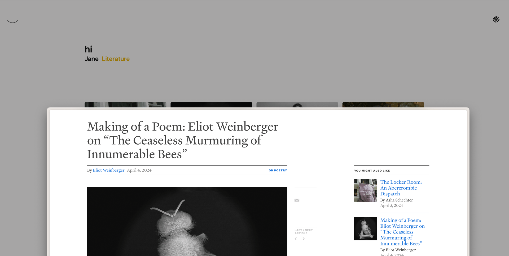
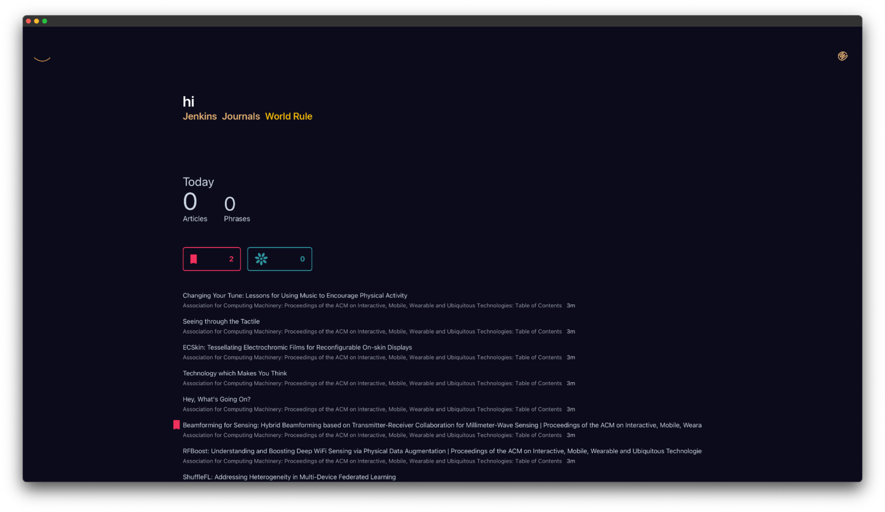

<!--  -->

# Stories

Make sense of the outer world that affects **your narrative**.

## Benefits

### Features

-   Follow RSS feeds
-   Follow Websites
-   Thumbnail and List views
-   Directories

## Build the app

1. Install [Node JS](https://nodejs.org/en/download)
2. Install [Yarn](https://classic.yarnpkg.com/lang/en/docs/install/#mac-stable), a nicer Node package manager
3. Install [Rust](https://www.rust-lang.org/tools/install), for compiling Rust binaries
4. In your terminal navigate to the project directory, then `./stories`
5. In your terminal run `yarn tauri build`

## Develop the app

Use `yarn tauri dev`, not `yarn dev`.

### Windows

- You will need to install vcpkg and the provided dependency with it that the main build step mentions.

### Ubuntu

- Install additional libraries as required for your OS
    - Refer to the current build file in `./.github/workflows/test-on-pr.yml`

### Fedora

- The steps are the Fedora equivalent of Ubuntu

## Q &amp; A

- **Q)** Can this replace Feedly or Reeder?
    - **A)** No, nothing can replace Feedly.
- **Q)** Can you provide 1-click app downloads?
    - **A)** Not yet. App signing is required.
- **Q)** How come Windows doesn't get tested on GitHub?
    - **A)** The libraries are not compatible with GitHub's Windows build environment. It does build on Windows Server in my testing.
