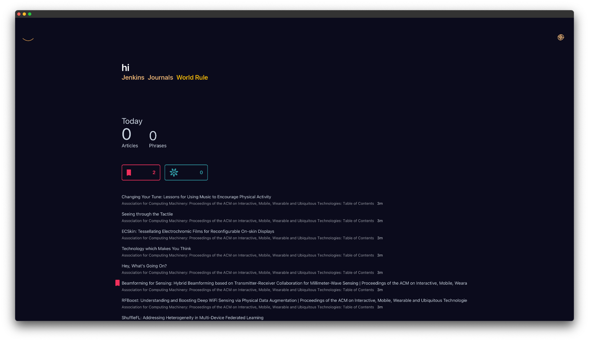

<!--  -->

# Stories

Make sense of the outer world that affects **your narrative**.

## Outstanding Bugs

### Rote App Crash

Unfortunately, after about a day of use the app eventually crashes.

The solution at first will be to remove the readability functionality that is used to extract the articles for the article search index. The decision to remove functionality is because the integrity of the application should come first.

The crash is a segmentation fault associated with unsafe C code being used with data that has no guaranteed conformity. Segmentation faults should not occur in Rust code by design. In this case we are using code from another library written in another language in an unsafe way.

I have considered how to handle search and categorisation functionality moving forwards, and OpenAI is on the cards. The issue with sending data to a third party is it breaks the entire purpose of this app being more private. When you are not private it opens you up directly to harassment, bullying, and being defeated or forestalled. No service can be guaranteed to be safe. *I’d like to mention here that consuming **anything** will program you by design. Avoid large crowds where possible.*

Useful libs that cause issue
- hashbrown
- libxml

## Benefits

### Features

-   Follow RSS feeds
-   Follow Websites
-   Thumbnail and List views
-   Directories
-   (more to come)

### Stack

-   A UI built in React atop a Rust application using Tauri
-   Core functionality resides in the Chirp lib
-   Other functionality resides in crates within separate repo's

## Build the app

1. Install [Node JS](https://nodejs.org/en/download)
2. Install [Yarn](https://classic.yarnpkg.com/lang/en/docs/install/#mac-stable), a nicer Node package manager
3. Install [Rust](https://www.rust-lang.org/tools/install), for compiling Rust binaries
4. In your terminal navigate to the project directory, then `./stories`
5. In your terminal run `yarn tauri build`

### Windows

- You will need to install vcpkg and the provided dependency with it that the main build step mentions.

### Ubuntu

- Install additional libraries as required for your OS
    - Refer to the current build file in `./.github/workflows/test-on-pr.yml`

### Fedora

- The steps are the Fedora equivalent of Ubuntu

## Q &amp; A

- **Q)** Can this replace Feedly or Reeder?
    - **A)** No, nothing can replace Feedly.
- **Q)** Can you provide 1-click app downloads?
    - **A)** Not yet. App signing is required.
- **Q)** How come Windows doesn't get tested on GitHub?
    - **A)** The libraries are not compatible with GitHub's Windows build environment. It does build on Windows Server in my testing.
